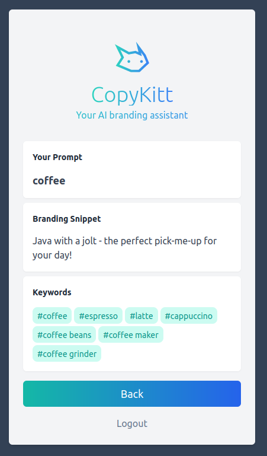

# Copykitt: Tutorial Project

This is a SaaS application that generates AI branding snippets and keywords for the customer's brand. 
It is a full stack application, and created as a tutorial for how to create AI driven full-stack
SaaS apps.

## Examples

Try out the demo here (requires authentication): https://www.copykitt.co

## Lambda Layer ZIP

I've decided to actually commit the Lambda layer zip file itself along with the project since a
few people have told me they have trouble building this Docker image themselves.

So you can either follow the tutorial and try to build it (it's easier on a Linux or Mac), or if
it doesn't work, then just use the `copykitt-infra/lambda_base_layer/layer.zip` file I have provided.

## Tech Stack

#### Backend Stack

| Type      | Tech                                                         |
| --------- | ------------------------------------------------------------ |
| Language  | [Python](https://www.python.org/)                            |
| Framework | [FastAPI](https://fastapi.tiangolo.com/)                     |
| Hosting   | [AWS](https://aws.amazon.com/) (Lambda + API Gateway)        |
| Other     | [OpenAI](https://openai.com/), [AWS CDK](https://aws.amazon.com/cdk/), [Docker](https://www.docker.com/) |

#### Frontend Stack

| Type      | Tech                                                         |
| --------- | ------------------------------------------------------------ |
| Language  | [Typescript](https://www.typescriptlang.org/)                |
| Framework | [NextJS](https://nextjs.org/) / [React](https://reactjs.org/) |
| Styling   | [TailwindCSS](https://tailwindcss.com/)                      |
| Hosting   | [Vercel](https://vercel.com)                                 |

## Tutorial Checkpoints

I've also added each part of the tutorial as a separate commit so it's easier to follow.

| Checkpoint                  |                                                              |
| --------------------------- | ------------------------------------------------------------ |
| Python app to call OpenAI   | [1e88180](https://github.com/pixegami/copykitt-tutorial/commit/1e88180dc55b5c10c869c32fe7bd168412a3c187) |
| Add FastAPI to Python app   | [aabaa16](https://github.com/pixegami/copykitt-tutorial/commit/aabaa16b036a921c7787dfabe6d6e80b65a7549c) |
| Host API on AWS             | [174d14f](https://github.com/pixegami/copykitt-tutorial/commit/174d14f8f5477c7b928445088951b2135f123a72) |
| Create NextJS/React website | [d1007b3](https://github.com/pixegami/copykitt-tutorial/commit/d1007b314a754f84573bf2b7281ae5ebebeb3d29) |
| Styling with TailwindCSS    | [818d04b](https://github.com/pixegami/copykitt-tutorial/commit/818d04bc670d23db24f95d1647aaa1fcbf90b474) |

## 